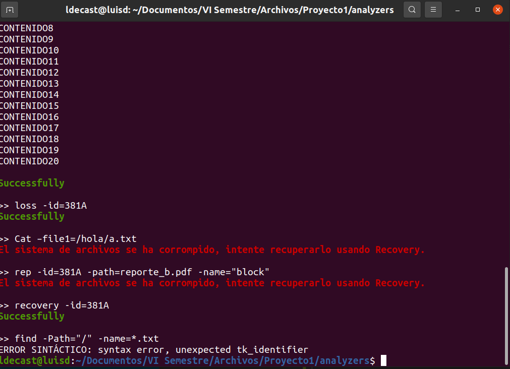
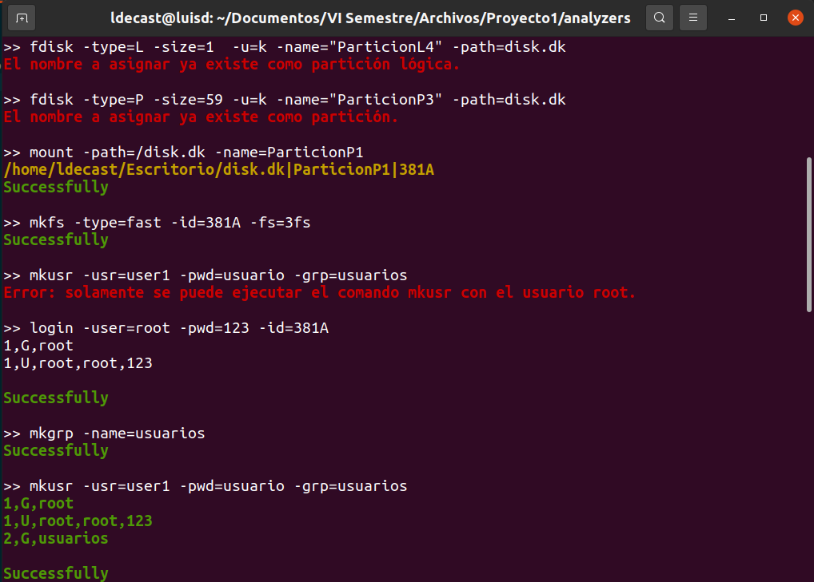
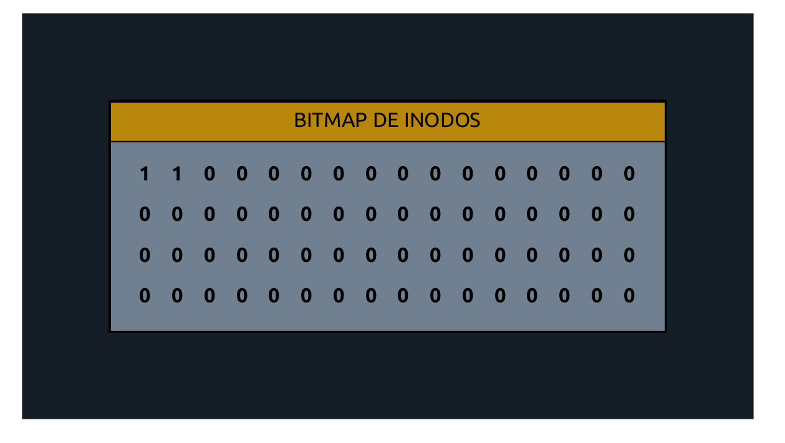
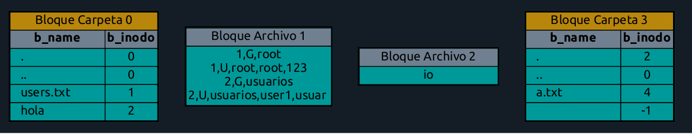
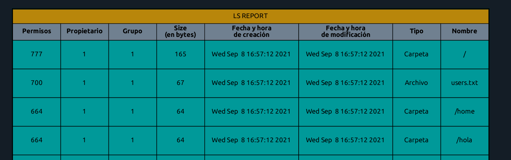
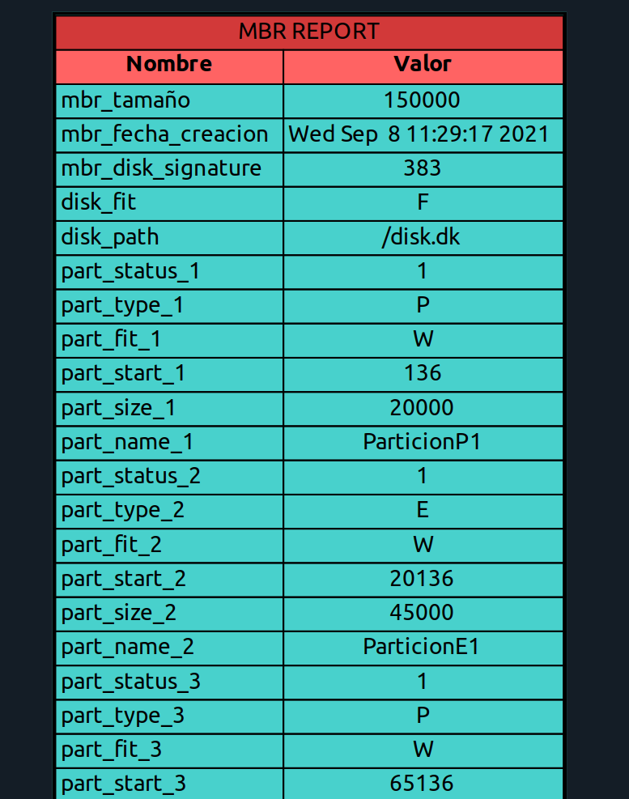

# Proyecto 1

### Autor: Luis Danniel Ernesto Castellanos Galindo
_Carnet: 201902238_

**Manejo e Implementación de Archivos. Segundo Semestre 2021**

 
 

# Manual de Usuario

El proyecto 1 de archivos se realizó para que se conozca los conceptos sobre la administración de archivos, 
tanto en el hardware como en el software. Además, de aprender los conceptos de particiones, 
sistemas de archivos, entre otros. El proyecto se basa en un aplicación de consola. 

## Administración de Discos
Contiene:
- MKDISK
- RMDISK
- FDISK
- MOUNT
- UMOUNT
- MKFS

1.MKDISK
~
Este comando tiene la funcionalidad de crear un archivo binario el cual tiene de objetivo simular un disco duro.
Este debe ocupar físicamente el tamaño indicado por los parámetros. 
~

|Parámetro|Descripción|
|--------|--------|
|    -size  |  Recibe un número que indica el tamaño del disco a crear, debe ser positivo y mayor a cero   |
|    -f   |   Indica el ajuste que utiliza el disco para crear las particiones dentro del disco. Podrá tener: *BF(indica el mejor ajuste), **FF(Utiliza el primer ajustable) y **WF*(Utiliza el peor ajuste) |
|    -u    |    Recibe una letra que indica las unidades que utiliza el parametro size. Podrá tener los siguientes valores: *k(indica que se utiliza kilobytes), **m*(utiliza megabytes) |
|    -path   |    Es la ruta en el que se creará el archivo que representará el disco duro. Si las carpetas de la ruta no existen deberán crearse.  |

2.RMDISK

Este parámetro elimina un archivo que representa a un disco duro, también muestra un mensaje de confirmación
para eliminar 

3.FDISK

Este comando administra las particiones en el archivo que representa al disco duro. En dado caso no se pueda 
realizar una partición se muestra un mensaje del porqué no pudo crearse. 

4.MOUNT

Este comando montará una partición del disco en el sistema e imprimira en consola un resumen de todas
las particiones montadas actualmente. Además, imprime una línea en consola por cada partición montada.

5.UMOUNT

Se encarga de desmontar una partición del sistema

|Parámetro|Descripción|
|--------|--------|
|    -id  |  Especifica el id de la partición que se desmontará  |

6.MKFS

Se encarga de realizar un formateo completo de la partición, también creará un archivo users.txt que tendrá
los usuarios y contraseñas del sistema de archivos.

## Administración de Usuarios y Grupos
Contiene:
- Login
- Logout
- Mkgrp
- Rmgrp
- Mkusr
- Rmusr

1.Login

Se encarga de iniciar sesión en el sistema

2.Logout

Se encarga de cerrar sesión en el sistema

3.Mkgrp

Se encarga de crear un grupo para los usuarios de la partición y se guardará en el archivo users.txt

4.Rmgrp

Se encarga de crear un grupo para los usuarios de la partición y se guardará en el archivo users.txt

5.Mkusr

Se encarga de crear un usuario en la partición. Solo lo puede ejecutar el usurio root. 

6.Rmusr

Se elimina un usuario en la partición, solo lo puede ejecutar el usuario root. 

## Administración de Carpetas Archivos y Permisos
Contiene:
- Chmod
- touch
- Cat
- rm
- Edit
- Ren
- Mkdir
- Cp
- Mv
- Find
- chown
- chgrp
- Pause

1.Chmod
~
Este comando cambia los permisos de un archivo o carpeta dentro del sistema de archivos
~
|Parámetro|Descripción|
|--------|--------|
|    -path  | Es la ruta en la que se encuentra el archivo o carpeta a la que se cambiarán los permisos|
|    -ugo | indica los permisos que tendran los usuarios |
|    -r | indica que el cambio será recursivo en el caso de carpetas. El cambio afectará a todos los archivos y carpetas en la que la ruta contenga la carpeta especifica |

2.touch
~
Este comando permitirá crear un archivo 
~
|Parámetro|Descripción|
|--------|--------|
|    -path  | Es la ruta del archivo que se creará|
|    -r | Si se utilizan este parámetro y las carpetas especificadas por el parámetro path |
|    -size | Indica el tamaño en bytes del archivo, el contenido serán números del 0 al 9 |
|    -cont | Indica un archivo en el disco duro de la computadora que tendrá el contenido del archivo|
|    -stdin | Es un parámetro mutuamente exclusivo con el parámetro cont. Indica que el contenido del archivo a crear será obtenido de stdin|

3.Cat
~
Este comando permitirá mostrar el contenido del archivo 
~
|Parámetro|Descripción|
|--------|--------|
|    -filen | Permite admitir como argumentos una lista de n ficheros |

4.rm
~
Este comando permitirá eliminar un archivo o carpeta y todo su contenido.
~
|Parámetro|Descripción|
|--------|--------|
|    -path | Es la ruta del archivo o carpeta que se eliminará |

5.Edit
~
Este comando permitirá editar el contenido de un archivo para asignarle otro contenido.
~
|Parámetro|Descripción|
|--------|--------|
|    -path | Es la ruta del archivo o carpeta que se edita |
|    -cont | contiene la ruta a un archivo en el sistema operativo que contendrá el contenido que será agregado a la edición. |
|    -stdin | Es un parámetro mutuamente exclusivo con el parámetro cont. Indica que el contenido a agregar al archivo será leído desde standard  input|

6.Ren

Este comando permitirá cambiar el nombr de un archivo o carpeta 

7.Mkdir

Este comando es similar a mkfile pero no crea archivos, sino carpetas

|Parámetro|Descripción|
|--------|--------|
|    -path | Es la ruta de ls carpeta que se creará |
|    -p | Si se utiliza este parametro y las carpetas padres en el parámetro y las carpetas padres en el parámetro path |

8.Cp

Este comando realiza una copia del archivo o carpeta 

9.M_V

Este comando mueve un archivo o carpeta y todo su contenido hacia otro destino.

10.Find

Este comando realiza una busqueda por el nombre del archivo o carpeta. 
Puede usar patrones léxicos.

11.chown
Este comando cambia el propietario de uno o varios archivos o carpetas

12.chgrp
Este comando cambia el grupo al que pertenece el usuario

13.Pause
Este comando solo es la palabra "pause" no tiene atributos al ingresar este comando se pone en pausa y 
se solicita que presione cualquier tecla para continuar.

  

### Interfaz de terminal:

  

 

  

  

### Reportes:

  

 

  

  

  

  

  

  

## Soporte técnico:

luis.danniel@hotmail.com

